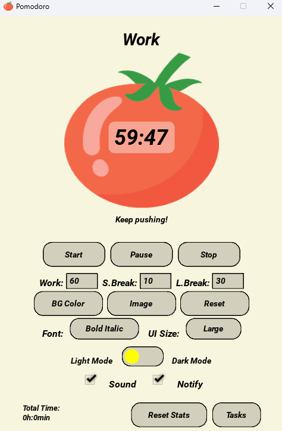
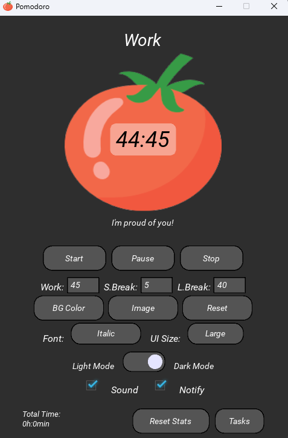

# 🍅 Pomodoro Focus Timer
**Developed by Maliss Dev**

---

### ✨ Productivity, Simplified.
A clean, aesthetic, and fully customizable Pomodoro timer designed to keep you in the zone.

### 🖼️ Preview
| Light Mode | Dark Mode |
| :---: | :---: |
|  |  |

### 🚀 Features
* **Custom Durations:** Set your own Work, Short Break, and Long Break times.
* **Themes:** Instant toggle between Light Mode, Dark Mode, and custom background colors and images.
* **Task Manager:** Built-in to-do list to track session goals.
* **UI Scaling:** Adjust interface size (Small, Medium, Large) to fit any screen.
* **Auto-Save:** Your settings, stats, and tasks are remembered automatically.

### 📥 Installation
1. Download `Pomodoro.exe` via the button above.
2. Run the file. No installation required.
3. *Note: If Windows SmartScreen appears, click "More Info" -> "Run Anyway".*

---
© 2026 Maliss Dev. All rights reserved.
