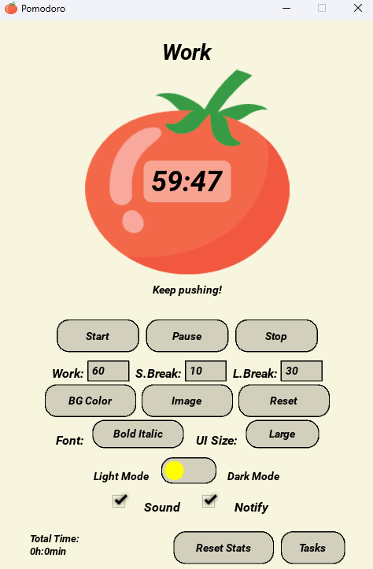
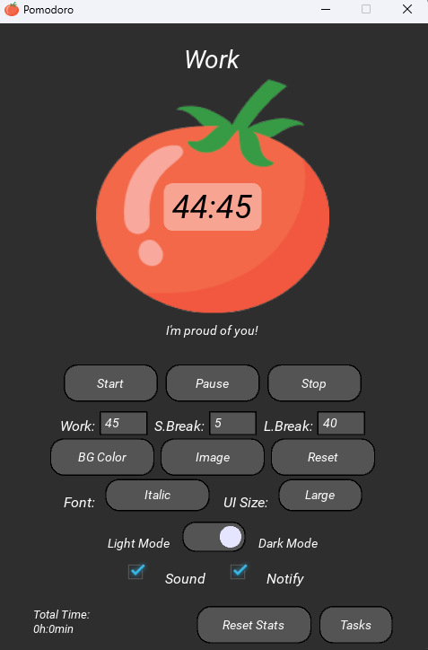

# 🍅 Pomodoro Focus Timer

**Developed by Kristiyan Staykov**

[](https://github.com/kris-staykov/Pomodoro-Focus-Timer/releases/tag/1.0.0)
[](LICENSE)
[](https://www.python.org/)
[](https://kivy.org/)

---

### ✨ Productivity, Simplified.

A clean, aesthetic, and fully customizable Pomodoro timer designed to keep you in the zone.

### 🖼️ Preview

| Light Mode | Dark Mode |
| :---: | :---: |
|  |  |

### 🚀 Features

* **Custom Durations:** Set your own Work, Short Break, and Long Break times.
* **Themes:** Instant toggle between Light Mode, Dark Mode, and custom background colors and images.
* **Adaptive Contrast:** The timer text automatically switches between black and white based on the brightness of your chosen background image.
* **Task Manager:** Built-in to-do list to track session goals.
* **UI Scaling:** Adjust interface size (Small, Medium, Large) to fit any screen.
* **Auto-Save:** Your settings, stats, and tasks are remembered automatically.

### ⏳ Timer Constraints

To ensure an effective workflow and maintain UI stability, the following limits are enforced:

| Timer Type | Minimum | Maximum |
| :--- | :--- | :--- |
| **Work Session** | 10 minutes | 120 minutes |
| **Short Break** | 5 minutes | 20 minutes |
| **Long Break** | 30 minutes | 60 minutes |

> **Note:** If an entered value exceeds these ranges, the app will automatically snap to the nearest valid limit.

### 🛠️ Built With

* **Python 3**
* **[Kivy](https://kivy.org/)** — cross-platform UI framework
* **[Pillow](https://python-pillow.org/)** — image brightness analysis for adaptive timer contrast

### 🐍 Run from Source

1. Clone the repository:
   ```bash
   git clone https://github.com/kris-staykov/Pomodoro-Focus-Timer.git
   cd Pomodoro-Focus-Timer
   ```
2. Install the dependencies:
   ```bash
   pip install -r requirements.txt
   ```
3. Run the app:
   ```bash
   python main.py
   ```

### 📥 Download (Windows)

1. Download `Pomodoro.exe` via the button above.
2. Run the file. No installation required.
3. *Note: If Windows SmartScreen appears, click "More Info" -> "Run Anyway".*

---

© 2026 Kristiyan Staykov — released under the [MIT License](LICENSE).
